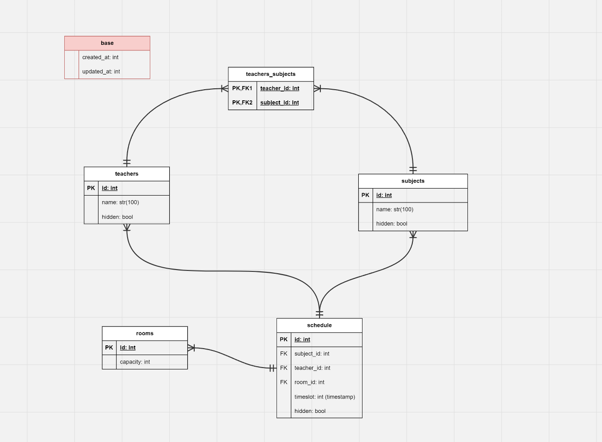

# Тестовое

```
Приложение представляет собой базу управления расписанием учебного заведения. 

У предметов должны быть преподаватели.
Один предмет может вести несколько преподавателей.
За один день преподаватель может провести до 5-и уроков.

Так же в расписании должен быть указан кабинет.
Кабинетов в учебном заведении 150(с 1 по 150 включительно).
Так же у каждого кабинета своя вместимость, которая хранится в базе данных.(для теста 2-3 кабинета хватит)

Пользователь должен иметь возможность обновлять расписание(добавить предмет, назначить ему преподавателя и выбрать кабинет).
Пользователь должен иметь возможность просматривать расписание на сегодняшний день.
При удалении данных запись должна скрываться из показа, но не удаляrm я из базы данных.

Так же составить подробную инструкцию по запуску. 
Не заморачивайся над интерфейсом, мне достаточно показать как ты в целом структурируешь код, работаешь с бд, самые основные моменты
```


### Запуск:

```bash
python -m venv venv
source venv/bin/activate
pip install -r requirements.txt
python main.py
```

### Проверка:

http://localhost:8000

### Статы

```bash
(venv) yunikeil@lekinu3600:~/python/TestIdeasHub$ git ls-files | xargs wc -l
  163 .gitignore
   49 app/database.py
   88 app/models.py
  120 app/routers.py
   22 app/schemas.py
  146 app/services.py
   35 main.py
   38 readme.md
    4 requirements.txt
  665 total
(venv) yunikeil@lekinu3600:~/python/TestIdeasHub$ 
```

### База

